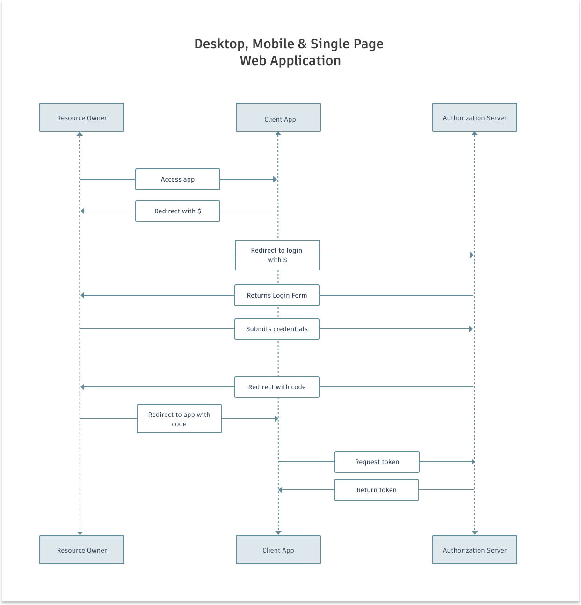
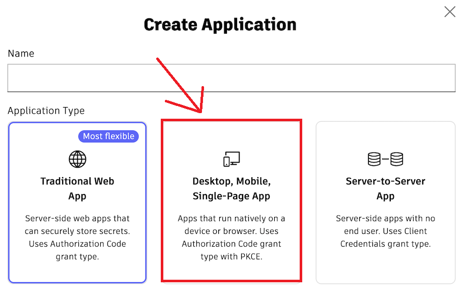
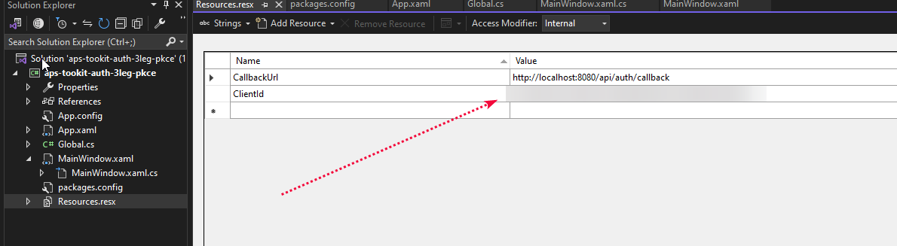
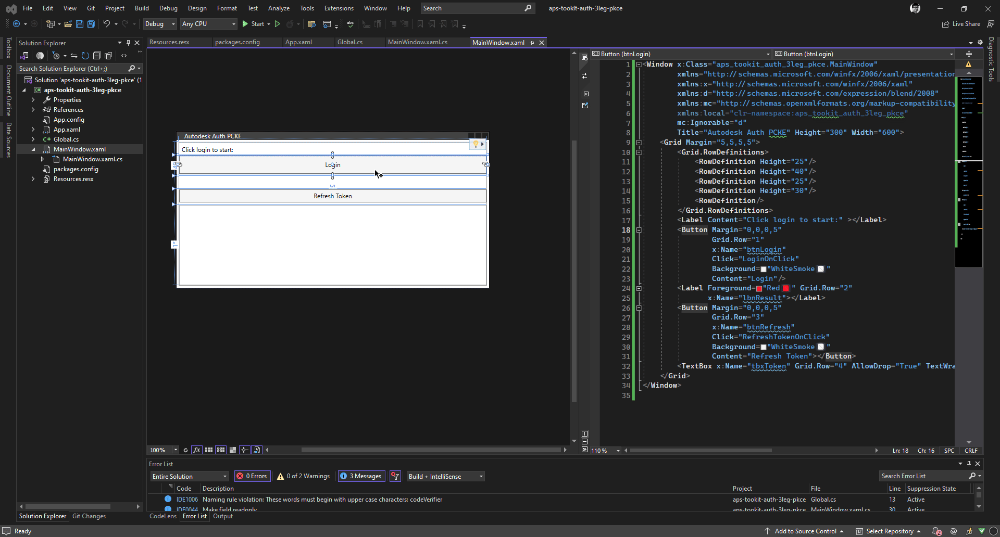

## Example Authentication Autodesk PCKE client-side only

Introduction
The purpose of this sample is demonstrate a quick way to test and obtain your three legged tokens using PKCE method in the context of a single page app (you can refer here for more [details](https://aps.autodesk.com/en/docs/oauth/v2/tutorials/get-3-legged-token-pkce/)).

This is opensource help question of PhatTran from LinkedIn : https://www.linkedin.com/feed/update/urn:li:activity:7192374744157941760/

## Usage 

- Create a application from website [`aps.autodesk.com`](https://aps.autodesk.com/)

- Copy the `client_id` to `Resources.resx`

- Create a callback URL in the format `http://localhost:8080/api/auth/callback` and add it to the `Redirect URIs` in the application settings, and then add it to the `Resources.resx`

- Debug the application and see the result

## Demo 

## Resources 

- https://github.com/autodesk-platform-services/aps-pkce-desktop-app
- https://github.com/autodesk-platform-services/aps-pkce-webapp
- https://aps.autodesk.com/blog/new-application-types
- https://github.com/JoaoMartins-callmeJohn/PKCE-TEST